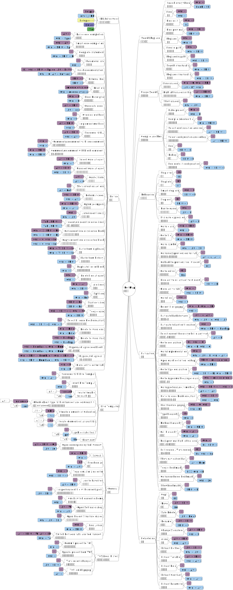

### IDE and Editor Keymap

#### IDE和编辑器快捷键映射

使用`FreeMind`制作的快捷键对照思维导图  
目前编写了`IntelliJ IDEA`和`Eclipse`的快捷键  

TODO: 

    Notepad++  
    Emacs  
    Vim
    ...

  
  
分别导出了`png`格式和`svg`格式的图像  
`svg`格式使用浏览器打开, 支持`Ctrl + F`查找
  
欢迎提`PR`或`fork`

